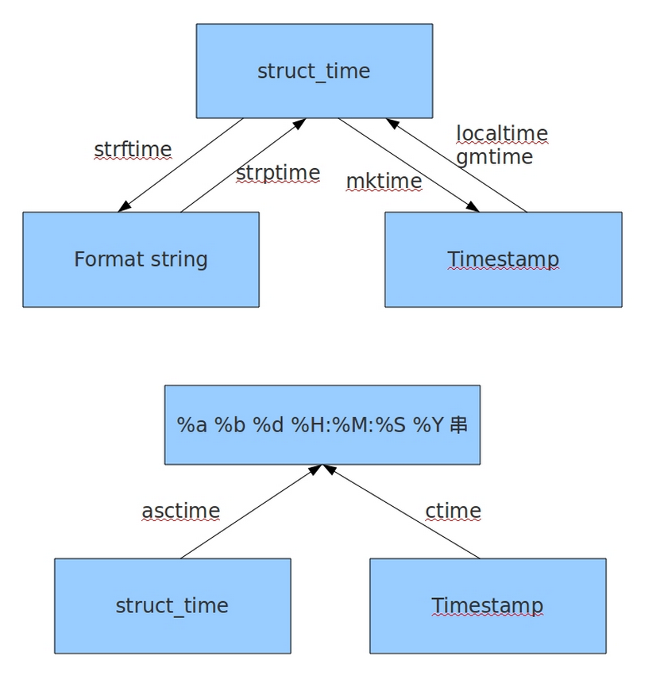

# python中time、datetime模块的使用

[TOC]

## 1、前言

如果您从事过python web的开发，那一定有过这样的经历，对于各种复杂繁琐的业务逻辑，掺杂着各种各样的时间约束，让人很容易搞的头晕眼花，比如展示出一天内用户进行过的所有操作记录，再比如进行验证码验证时获取当前时间与验证码生成时间进行比较，检查是否超过10分钟过期时间之类。这些关于时间的业务逻辑，要求我们必须能熟练掌握python中关于时间的两个模块，time和datetime，只有用好了这两个模块，我们才能在代码中轻松自如的应对。

## 2、time模块

time模块中时间表现的格式主要有三种：

- a、timestamp时间戳，时间戳表示的是从1970年1月1日00:00:00开始按秒计算的偏移量

- b、struct_time时间元组，共有九个元素组。

- c、format time 格式化时间，已格式化的结构使时间更具可读
性。包括自定义格式和固定格式。

### 1、时间格式转换图



### 2、常用方法

```python
import time

print(time.time())  # 当前时间戳
>>> 1569645479.6079931

print(int(time.time()))
>>> 1569645479

print(time.strftime('%Y-%m-%d %H:%M:%S'))  # 格式化的时间
>>> 2019-09-28 12:37:59

print(time.strftime('%Y-%m-%d'))
>>> 2019-09-28

print(time.strftime('%H:%M:%S'))
>>> 12:37:59

print(time.gmtime())  # 获取标准时区的时间元组，如果传入了时间戳，就是把时间戳转换成时间元组
>>> time.struct_time(tm_year=2019, tm_mon=9, tm_mday=28, tm_hour=4, tm_min=37, tm_sec=59, tm_wday=5, tm_yday=271, tm_isdst=0)

print(time.gmtime(1569645453))
>>> time.struct_time(tm_year=2019, tm_mon=9, tm_mday=28, tm_hour=4, tm_min=37, tm_sec=33, tm_wday=5, tm_yday=271, tm_isdst=0)

# 使用时间戳获取代码执行时间
s_time = time.time()
for i in range(0,10):
    time.sleep(1)
e_time = time.time()
print('代码运行时间是：', e_time-s_time)
>>> 代码运行时间是： 10.003105163574219

# 字符串格式化时间转换时间戳
str_time = '2019-9-28'
print(time.mktime(time.strptime(str_time, '%Y-%m-%d')))
>>> 1569600000.0

# 时间戳转换成格式化的时间字符串
gsh_time = time.time()
print(time.strftime('%Y-%m-%d', time.localtime(gsh_time)))
>>> 2019-09-28


```

## 3、datetime模块

datatime模块重新封装了time模块，提供更多接口，提供的类有：date,time,datetime,timedelta,tzinfo。

```python
import datetime

now = datetime.datetime.now()
print(now)
>>> 2019-09-28 12:45:59.927901

now = datetime.datetime.now()
d1 = now - datetime.timedelta(hours=1)  # 获取前一小时
d2 = now - datetime.timedelta(days=1)  # 获取前一天
print(now)
>>> 2019-09-28 12:47:56.662933
print(d1)
>>> 2019-09-28 11:47:56.662933
print(d2)
>>> 2019-09-27 12:47:56.662933

# datetime对象转换成时间戳
dt = datetime.datetime.now()
print(time.mktime(dt.timetuple()))
>>> 1569646475.0

# 时间戳转换成datetime对象
sjc_time = time.time()
print(datetime.datetime.fromtimestamp(sjc_time))
>>> 2019-09-28 12:55:05.500752


```